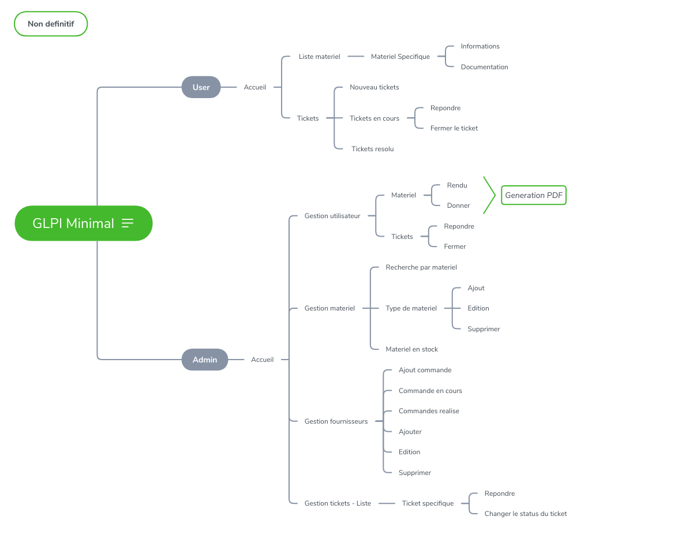

# GLPI Minimal

## Objectif

Developper un site interne lie au CRM permettant la gestion du parc informatique.

La gestion devra avoir ces fonctionnalites:

*** Commande ***
```
- Une commande est une liste d'objets
- Chaque commande a un status: En cours/Recue
- Chaque commande a un commentaire facultatif
- Une commande avec le status recu rajoute les objets indique dans la liste des objets disponible
- Une commande est editable

Facultatif:

- Il est possible qu'une commande soit recu en partie
```

*** Objet ***
```
- Un objet commande est un paquet contenenant plusieurs elements (Par exemple un ordinateur est une carte mere, avec de la ram, un ecran, une sacoche, un windows, un souris, clavier ...)
- Un objet est soit en stock, soit il est liste comme appartenant a une personne
- Un objet appartenant a une personne a une date de don ainsi qu'un etat au moment du don
- Un objet rendu doit etre mis a jour avec un nouvel etat
- L'action de donner/rendre un objet est suivit de la creation d'un fichier pdf definissant l'action executer
```

*** Fournisseurs ***
```
- Les fournisseurs sont defini par un contact (adresse, email, nom), les commandes effectue ainsi qu'un commentaire facultatif
```

## Cible

Personnes charge de la gestion du parc informatique au sein de/des agences actecil

## Budget

Fait en interne, il n'y a donc pas de budget

## Arborescence



## BDD

En cour de creation

## Maquette

Non disponible

## Site en ligne

Site d'origine: 

[GLPI](https://demo.glpi-project.org/index.php?noAUTO=1)

## Historique de modification

- 14/09/18: Creation du concept, du depot ainsi que l'arborescence du projet